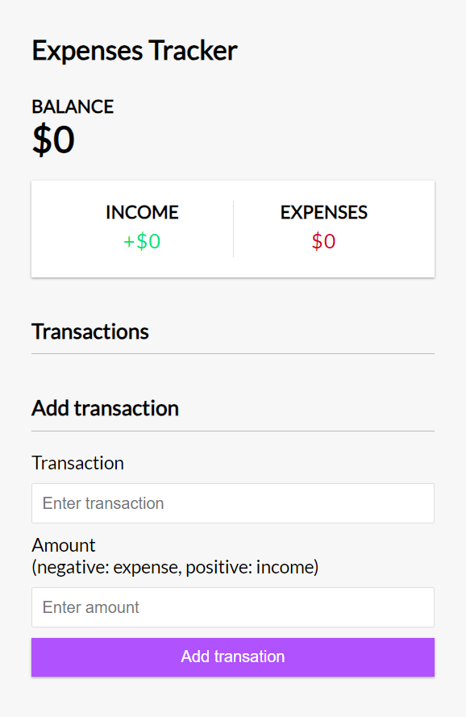
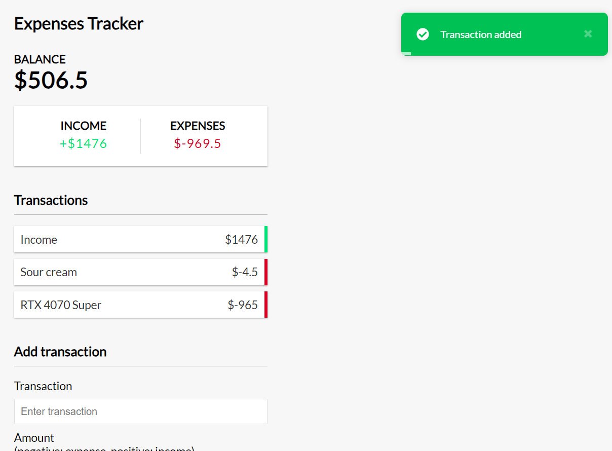

# Vue Expense Tracker
An intuitive expense tracker built with Vue 3 using the Composition API. This application helps you track your expenses effortlessly, with data persistence through local storage and friendly notifications powered by Vue-toastification.

## Features
- Add and manage expenses: Keep track of your spending by adding or deleting expense entries.
- Local Storage: All data is stored locally on your device, so you won’t lose your information even after refreshing or closing the app.
- User-friendly notifications: Enjoy seamless interactions with real-time notifications for your actions, courtesy of Vue-toastification.
- Responsive Design: Access and manage your expenses across different devices with a responsive user interface.

## Screenshots
### Home Page 

### Home Page with Toast & Transactions

## Installation
1. Clone the repositiory
> git clone https://github.com/yangzhie/expense-tracker.git
> cd expense-tracker

2. Install dependencies
> npm i

3. Run the application
> npm run serve

## Future Features
- editing transaction option